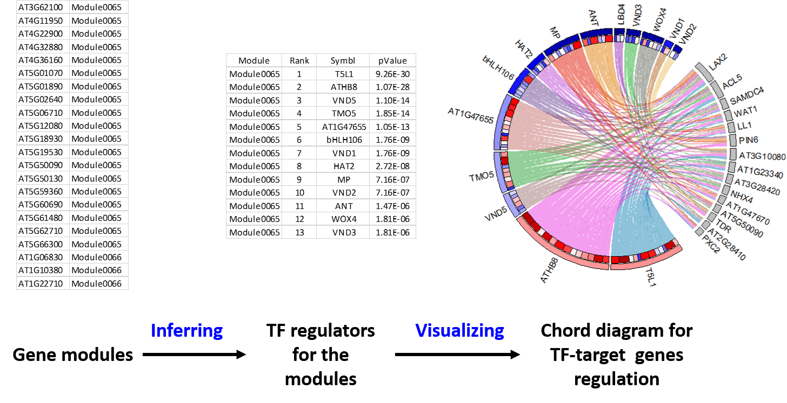
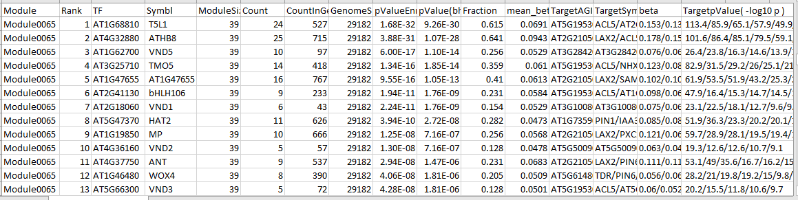

# explicit

**Got a list of genes and you wonder what TFs regulate their expression? EXPLICIT is the right tool to try.**

The EXPLICIT approach has been developed to construct a gene expression predictor model for the plant species *Arabidopsis thaliana*. The predictor uses the expression of 1,678 transcription factor (TF) genes to predict the expression of 29,182 non-TF genes. It further enables downstream inference of TF regulators for genes and gene modules functioning in diverse plant pathways. Please check the original paper by [Geng *et al.*](https://github.com/MaShisongLab/explicit#Reference) for more details. The EXPLICIT package presented here enables users to 1. Infer TF regulators for their own gene modules; 2. Draw chord diagrams showing TF-target genes regulation for the modules; 3. Create custom gene expression predictors using their own gene expression data. (*Note: below is an example showing the analysis flow-chart for a gene module involved in vascular system development.*)

<a></a>

## Table of Contents
- [Install](https://github.com/MaShisongLab/explicit#Install)
- [Usage](https://github.com/MaShisongLab/explicit#Usage)
   - Infer TF regulators for gene modules
   - Draw chord diagrams showing TF-target genes regulation for the modules
   - Create custom gene expression predictor
- [Reference](https://github.com/MaShisongLab/explicit#Reference)

## Install
This package requires [Perl](https://www.activestate.com/products/perl/downloads/), [R](https://www.r-project.org/), and the [circlize](https://www.rdocumentation.org/packages/circlize/) package in R. 

`circlize` can be installed within an R console via the command:

```R
install.packages("circlize")
```
[MATLAB](https://www.mathworks.com/products/matlab.html) is optional. Only required if you want to create your own predictor model using custom expression data. 

Once the required software is installed, just download or clone the whole package to a local computer and start using it from the package's home directory. 

## Usage

### 1. Infer TF regulators for gene modules

#### (1). Prepare the module file
The file used to store gene modules information is `modules_to_analyze.txt`. It is preloaded with 1,085 gene modules identified from a gene co-expression network described in the paper by [Geng <i>et al.</i>](https://github.com/MaShisongLab/explicit#Reference). The following analysis will proceed with these preloaded modules. On the other hand, you can also edit the file, replacing these modules with your own ones. The file has two tab-separated columns, with the first column being gene ids and the second being module names. For gene ids, only standard Arabidopsis AGI ids are supported. Multiple modules can be analyzed at the same time. <i>Once finish editing, save the file without changing its name</i>.
```
AT5G59360	Module0065
AT5G60690	Module0065
AT5G61480	Module0065
AT5G62710	Module0065
AT5G66300	Module0065
AT1G06830	Module0066
AT1G10380	Module0066
.........   ........
```
#### (2). Conduct enrichment assay to identify TF regulators for the modules
The Perl script `getArabidopsisRegulatorTFs.pl` will do the job. It takes the modules from the file `modules_to_analyze.txt` to conduct enrichment assays to identify potential TF regulators. Results are saved to a file named `results.regulator.tfs.txt`.

Open a command line window or shell terminal, navigate to the home directory of the EXPLICIT package, and type in the following command:
```shell
perl getArabidopsisRegulatorTFs.pl
```

The resulted file `results.regulator.tfs.txt` can be opened and viewed in EXCEL. It lists the potential TF regulators for every input modules. Here is an example: 




### 2. Draw chord diagrams showing TF-target genes regulation for the modules

The `getChordDiagram` function can be used to draw chord diagrams for the modules in R. The function extracts the TF-target gene pairs from the file `results.regulator.tfs.txt` for the input module, and then uses these gene pairs to draw a chord Diagram accordingly. It has four input variables:<br>
`module` - the name of the module <br>`ratio` - the relative size of the target gene area occupies <br>`tfnum` - the maximum number of TF genes to be included in the diagram <br>`targetnum` - the maximum number of target genes to be included in the diagram.<br><br>

Open an R console and change the working directory to the home directory of the EXPLICIT package. Within the R console, type in the following commands:
```R
# R code
# Load the scripts that define the getChordDiagram function.
source("Rscripts.R")  

# The function requires the 'circlize' package
library("circlize")

# To draw a chord diagram for Module0065
getChordDiagram( module="Module0065", ratio = 1, tfnum = 50, targetnum = 15)

# To draw a chord diagram for Module0084
getChordDiagram( module="Module0084", ratio = 1, tfnum = 50, targetnum = 15)

# Change the relative size of the target gene area
getChordDiagram( module="Module0084", ratio = 0.6, tfnum = 50, targetnum = 15)

# To draw a chord diagram for Module0046
getChordDiagram( module="Module0046", ratio = 1, tfnum = 50, targetnum = 15)

# A chord diagram with only the top 30 TFs
getChordDiagram( module="Module0046", ratio = 1, tfnum = 30, targetnum = 15)

# To draw chord diagrams for other modules
getChordDiagram( module="Module0105", ratio = 1, tfnum = 50, targetnum = 15)
getChordDiagram( module="Module0272", ratio = 1, tfnum = 50, targetnum = 15)
getChordDiagram( module="Module0011", ratio = 1, tfnum = 50, targetnum = 15)
```
Here are some output diagrams:


### 3. Create custom gene expression predictor 
We currently only have the gene expression predictor model for *Arabidopsis thaliana*. We are working on predictor models for other species. At the same time, you can also create your own custom gene expression predictor (<i>Note: a large number of samples are required for training the model</i>). The MATLAB function <B>`explicit`</B>, as specified within the file `explicit.m`, is used to create the predictor model. The file can be found within the home folder of the package. The function has the following syntax:
```matlab
explicit( TF_expression, TG_expression, TF_name, TG_name)
```
`TF_expression`: the expression matrix for TF, with samples in rows and genes in columns  <br>
`TG_expression`: the expression matrix for target genes, with samples in rows and genes in columns <br> 
`TF_name`: the names of the TF genes <br>
`TG_name`: the names of the target genes <br>

Below we describe the detailed procedure to create the Arabidopsis predictor. The procedure can be adapted to analyze other custom gene expression data.

#### (1). Obtain the Arabidopsis gene expression matrix
Download two matrices `At.matrix.demo.h5` and `At.matrix.full.h5` from [Figshare](https://figshare.com/s/0c838ad4ef6a764daf53) (https://figshare.com/s/0c838ad4ef6a764daf53) , and place them within the <b>home folder of the EXPLICIT package </b>. We prepared these two matrices by compiling publically available RNA-Seq datasets from NCBI, and used them to train the Arabidopsis predictor. `At.matrix.full.h5` is a full matrix with 24545 samples, while `At.matrix.demo.h5` has 5000 randomly selected samples from the full matrix. <i>We recommend to work with the smaller matrix `At.matrix.demon.h5` first</i>, as it requires less computational resources. Both matrices are saved in hdf5 file format, with the following data structure. Note that both files also contain an additional matrix with independent samples for validation. 
```bash
At.matrix.demo.h5
├─expression_log2cpm  		(5000 samples [row] X 38194 genes [column])
├─gene_name			(38194 genes)
├─rnaseq_id			(5000 samples)
├─idx_tf_gene			(specifying TF genes used for model construction)
├─idx_target_gene 		(specifying target genes used for model construction)
└─independent_samples_for_validation
   ├───expression_log2cpm  	(2 samples [row] X 38194 genes [column])
   ├───gene_name		(38194 genes)
   └───sample_id		(2 samples)
   
At.matrix.full.h5
├─expression_log2cpm  		(24545 samples [row] X 38194 genes [column])
├─gene_name			(38194 genes)
├─rnaseq_id			(24545 samples)
├─idx_tf_gene			(specifying TF genes used for model construction)
├─idx_target_gene 		(specifying target genes used for model construction)
└─independent_samples_for_validation
   ├───expression_log2cpm  (2 samples [row] X 38194 genes [column])
   ├───gene_name		(38194 genes)
   └───sample_id		(2 samples)
```
#### (2). Create the expression predictor
The following analysis builds a gene expression predictor model using the smaller matrix. The analysis is conducted within a MATLAB console. * The analysis is memory-intensive and requires around 20G computer memory.*
```matlab
% MATLAB code
% Navigate to and start within the home directory of the EXPLICIT package.

% Obtain the expression matrix and gene names for from At.matrix.demo.h5. 
% The matrix contains 5000 samples (in rows) and 38194 genes (in columns)
mtx_demo = h5read("At.matrix.demo.h5","/expression_log2cpm");
gene_name = h5read("At.matrix.demo.h5","/gene_name");

% itf specifies which of the 38194 genes are TFs to be used.  1678 TFs are selected in total.
itf = h5read("At.matrix.demo.h5","/idx_tf_gene") == 1; 	

% itarget specifies which of the 38194 genes are target genes to be used. 29182 target genes are selected in total.
itarget = h5read("At.matrix.demo.h5","/idx_target_gene") == 1; 	

% Obtain the TF expression matrix, target gene expression matrix
tf_mtx_demo = mtx_demo(:,itf);
target_mtx_demo = mtx_demo(:,itarget);

% Obtain the TF gene names and target gene names
tf_name = gene_name(itf);
target_name = gene_name(itarget);

% Produce the predictor model
mdl_demo = explicit( tf_mtx_demo, target_mtx_demo, tf_name, target_name);

% Take a look into the predictor model
mdl_demo 	

% The first 5 significant TF-target gene pairs
mdl_demo.SigEdges(1:5,:)  
```

The output is:
```bash
mdl_demo = 

  explicit with properties:

                          beta: [1679x29182 double] 	% beta coefficients (1 intercept + 1678 TFs) X 29182 genes
                   beta_pvalue: [1679x29182 double] 	% pValues for the beta coefficiets
                       TF_name: [1x1679 string]     	% names for 1 intercept + 1678 TFs
                   Target_name: [1x29182 string]    	% names for 29182 gene
                         NRMSE: 0.0660			% NRMSE for all the training samples
         Correlation_by_sample: [5000x1 double]		% R of predicted &acutal expression for 5000 samples
    Correlation_by_target_gene: [29182x1 double]    	% R of predicted & actuall exp of each gene across all samples
                           SST: [29182x1 double]    	% SST for regression model of every gene
                           SSR: [29182x1 double]    	% SSR for regression model of every gene
                           SSE: [29182x1 double]	% SSE for regression model of every gene
                         Fstat: [29182x1 double]	% Fstat for regression model of every gene
                       Fpvalue: [29182x1 double]	% Fpvalue for regression model of every gene
                      SigEdges: [252595x4 table]	% Significant TF-target gene pairs with pValue <= 0.00001

mdl_demo.SigEdges(1:5,:) =
       Gene            TF          beta      beta_pvalue
    ___________    ___________    _______    ___________

    "AT1G01020"    "AT1G01010"     0.1231     1.373e-23 
    "AT1G01020"    "AT1G15790"    -0.0596     1.074e-06 
    "AT1G01020"    "AT1G25580"    -0.0828     2.755e-06 
    "AT1G01020"    "AT1G30490"     0.0908     1.053e-06 
    "AT1G01020"    "AT2G01060"     0.1191     7.535e-06 
```
#### (3). Use the predictor model to predict independent samples
We have generated two independent RNA-Seq datasets from Arabidopsis shoot and root samples. These two datasets were not used in the model training. Below we test how well the predictor model predict these two samples. <i>Note: the order of the gene names within the test samples are the same as those within the demo matrix. </i> 
```matlab
% MATLAB code - continued
% Obtain expression matrix for the test samples
test_mtx = h5read("At.matrix.demo.h5","/independent_samples_for_validation/expression_log2cpm");

% test_mtx contains two rows, for 'root' and 'shoot' samples, respetively.
test_sample_id = h5read("At.matrix.demo.h5","/independent_samples_for_validation/sample_id");

test_tf_mtx = test_mtx(:,itf);
actual_target_mtx = test_mtx(:,itarget);  

% Predict the expression values for target genes via the formula: 
% Predicted expression = [intercept (values of 1) + TF's expression matrix] X beta coefficient matrix
predicted_target_mtx = [ones(size(test_tf_mtx,1),1) test_tf_mtx] * mdl_demo.beta ;

% Calculate the correlation between predicted and actual expression values
corr( actual_target_mtx(1,:)', predicted_target_mtx(1,:)') % The correlation for root is 0.9920
corr( actual_target_mtx(2,:)', predicted_target_mtx(2,:)') % The coorelation for shoot is 0.9900

% Calculate NRMSE (Normalized Root Mean Square Error)
% NRMSE for root & shoot samples are 0.0858 & 0.1016
residual_mtx = predicted_target_mtx - actual_target_mtx ;
NRMSE = sqrt(sum(residual_mtx.^2, 2) ./ sum( actual_target_mtx.^2, 2)) 
```
<b>Note: If you want to use your own RNA-Seq datasets to test the model, make sure the gene names matched in the same order to the gene names of the TF and target gene matrices used above, and the gene expression value should be log2 transformed (log2(CPM + 1)). Alternatively, you can arrange the TFs and target genes of the demo matrix with the same order as your RNA-Seq datasets, and create the gene expression predictor accordingly. </b>

#### (4). Investigate how the number of training samples affects the predictor power
The number of training samples affects the predictor's predicting power. The function <b>`explicit_eosn`</b>, standing for effect of sample number, investigates such effects. Its inputs are `(TF_expression, Target_expression, TestSampleNum)`, with `TestSampleNum` being the number of samples randomly selected and hold out as test samples.
```matlab
% MATLAB code - continued
% Hold out 500 samples as test samples
mdl_eosn = explicit_eosn( tf_mtx_demo, target_mtx_demo, 500) 
mdl_eosn
mdl_eosn.stat
```
The output is:
```bash
    Run    TrainingSampleNum    R_training    NRMSE_training    R_test     NRMSE_test
    ___    _________________    __________    ______________    _______    __________

     1           1700            0.99995        0.0071425       0.68378       0.931  
     2           1725            0.99988         0.010676       0.79395     0.63758  
     3           1750            0.99983         0.013001       0.82836     0.54658  
     4           1775            0.99975         0.015839       0.86977     0.43926  
     5           1800            0.99969         0.017487       0.88968     0.38962  
     6           1850            0.99958         0.020327       0.91018     0.34773  
     7           1900            0.99943         0.023749       0.92621     0.30313  
     8           1950             0.9993         0.026351       0.93624     0.27771  
     9           2000             0.9992         0.028108       0.94274     0.26096  
    10           2100            0.99897         0.031836       0.95118      0.2338  
    11           2200            0.99877         0.034816       0.95963     0.20954  
    12           2300            0.99854         0.037856       0.96267     0.20082  
    13           2400            0.99838         0.039831       0.96647     0.18906  
    14           2500            0.99819         0.042092       0.96992     0.17783  
    15           3000            0.99737          0.05082       0.97769     0.15087  
    16           3500            0.99679         0.056046         0.981     0.13833  
    17           4000            0.99629         0.060238       0.98307        0.13  
    18           4500            0.99587          0.06356       0.98441     0.12439  
```
Eighteen predictor models were built with between 1700 and 4500 training samples, and the predicting accuracy on test samples (R_test) increased along with the number of training samples.
#### (5). Perform K-fold Cross-Validation
K-fold Cross-Validation can be also used to test the predictor's performance. The function <b>`explicit_kfcv`</b> does the job. Its inputs are `(TF_expression, Target_expression, tf_name, target_name, repeats, folds)`, with `repeats` and `folds` being the number of repeats and the folds for the analysis.
```matlab
% MATLAB code - continued
% Perform 5 repeats of 10-fold Cross-Validation
mdl_kfcv = explicit_kfcv(tf_mtx_demo, target_mtx_demo, tf_name, target_name, 5, 10) 
mdl_kfcv
mdl_kfcv.CV_Stat
mdl_kfcv.AllEdges(1:5,:)
```
The output is:
```bash
mdl_kfcv = 

  explicit_kfcv with properties:

                 Total_repeats: 5
                   Fold_number: 10
    Correlation_of_target_gene: [29182x50 double]	% R of target genes in test samples in all 50 CV runs
              Target_gene_name: {29182x1 cell}
                      AllEdges: [48996578x9 table]	% The statistics for each coefficient across 50 CV runs
                       CV_Stat: [50x6 table]		% R and NRMSE for training and test samples in each CV run
                       
mdl_kfcv.CV_Stat =
   Repeat    Fold_No    NRMSE_training    NRMSE_test    R_training    R_test 
    ______    _______    ______________    __________    __________    _______

      1          1          0.063782        0.12305       0.99584      0.98481
      1          2          0.063719        0.12509       0.99585      0.98418
      1          3          0.063326        0.13161        0.9959      0.98232
      1          4          0.063505        0.13506       0.99588      0.98209
      1          5          0.063122        0.14025       0.99592      0.98067
      1          6          0.063771        0.11977       0.99584      0.98526
      1          7          0.063166        0.13044       0.99591      0.98294
      1          8          0.063427         0.1368       0.99589      0.98111
      1          9          0.063389        0.13608       0.99589      0.98168
      1         10           0.06349        0.13053       0.99588      0.98278
      2          1          0.063595        0.13268       0.99586      0.98234
      2          2          0.063495        0.12829       0.99587      0.98335
      2          3          0.063617        0.12701       0.99586      0.98347
      2          4           0.06349        0.12768       0.99588      0.98357
      2          5           0.06351        0.13197       0.99587      0.98255
     ...	...		...	       ...	     ...	  ...

mdl_kfcv.AllEdges(1:5,:) =
     Gene            TF          beta      beta_pvalue    CV_beta_mean    CV_beta_std    beta_bias    beta_relative_bias    relative_std
    ___________    ___________    _______    ___________    ____________    ___________    _________    __________________    ____________

    "AT1G01020"    "intercept"    0.58075       0.02262        0.58822        0.13633       0.00747           0.0129             0.2318   
    "AT1G01020"    "AT1G01010"    0.12307     1.373e-23        0.12226        0.01281      -0.00081           0.0066             0.1048   
    "AT1G01020"    "AT1G01030"    0.01859       0.08915        0.01981        0.00563       0.00122           0.0656             0.2842   
    "AT1G01020"    "AT1G01060"    -0.0292      0.001083       -0.02862        0.00599       0.00058           0.0199            -0.2093   
    "AT1G01020"    "AT1G01250"    0.02899       0.00919        0.02742        0.00629      -0.00157           0.0542             0.2294  

```
`mdl_kfcv.AllEdges` can be used to check if any of the coefficient is stable or not across the CV runs.
#### (6). Perform Cross-Validation on independent samples
The function <b>`explicit_cv`</b> can be used to conduct Cross-Validation. Its inputs are `(Training_TF_expression, Training_traget_expression, Test_TF_expression, Test_target_expression, Test_sample_ids)`. The function uses the Training TF and target expression matrices to build the predictor model, and then test the model on the Test samples. It provides a covenient way to generate and test different predictor models.
```matlab
% MATLAB code - continued

test_target_mtx = test_mtx(:,itarget);

% Use all 5000 samples in the demo matrix to build the preidctor model, 
% and test on the shoot and root RNA-Seq samples.
mdl_cv_5000 = explicit_cv( tf_mtx_demo, target_mtx_demo, test_tf_mtx, test_target_mtx, test_sample_id)

% Use only 4000, 3000, or 2000 samples to build the predictor model
mdl_cv_4000 = explicit_cv( tf_mtx_demo(1:4000,:), target_mtx_demo(1:4000,:), test_tf_mtx, test_target_mtx, test_sample_id)
mdl_cv_3000 = explicit_cv( tf_mtx_demo(1:3000,:), target_mtx_demo(1:3000,:), test_tf_mtx, test_target_mtx, test_sample_id)
mdl_cv_2000 = explicit_cv( tf_mtx_demo(1:2000,:), target_mtx_demo(1:2000,:), test_tf_mtx, test_target_mtx, test_sample_id)
mdl_cv_5000
mdl_cv_5000.Test_Sample_Stat
```
The output is:
```bash
mdl_cv_5000 = 

  explicit_cv with properties:

             Training_Sample_Num: 5000
               Actual_Target_Exp: [2x29182 double]
            Predicted_Target_Exp: [2x29182 double]
                 Test_Sample_Num: 2
                Test_Sample_Stat: [2x3 table]
           Test_Sample_NRMSE_all: 0.0933
    Test_Sample_Mean_Correlation: 0.9910

mdl_cv_5000.Test_Sample_Stat =
    Sample     R_test     NRMSE_test
    _______    _______    __________

    'root'     0.99196     0.085795 
    'shoot'    0.99002      0.10157 
```
When using 5000, 4000, 3000, or 2000 samples to train the predictor model, the mean correlation for test samples are 0.9910, 0.9891, 0.9841, 0.9572, respectively.
#### (7). Use the full matrix to perform the analysis
Next we will analyze the full matrix. <i>Note: Since the matrix is large, it requires a large amount of computational resource. It is recommended to have at least 80G memory available.</i>
```matlab
% MATLAB code
% clear all previous variables to free memory
clearvars ; 


% Step A. Create the predictor
mtx_full = h5read("At.matrix.full.h5","/expression_log2cpm");
gene_name = h5read("At.matrix.full.h5","/gene_name");

itf = h5read("At.matrix.full.h5","/idx_tf_gene") == 1;   
itarget = h5read("At.matrix.full.h5","/idx_target_gene") == 1;  

tf_mtx_full = mtx_full(:,itf);    
target_mtx_full = mtx_full(:,itarget);   

tf_name = gene_name(itf);
target_name = gene_name(itarget);

% This produces the predictor model.
mdl_full = explicit( tf_mtx_full, target_mtx_full, tf_name, target_name); 
mdl_full    

% The predictor has 3298936  SigEdges (TF-target gene pairs) with pValue <= 0.00001
% Next the SigEdges with pValue <= 1e-9 are extracted and saved to a file named "Arabidopsis.SigEdges.1e-9.txt". 
% This file is the same as the file "At.SigEdges.txt" within the data directory.
% There are 980736 SigEdges with pValue <= 1e-9. 
% These SigEdges are also the same SigEdges reported in the paper by Geng et al.
i = mdl_full.SigEdges{:,4} <= 1e-9 ;
sum(i)       
writetable( mdl_full.SigEdges(i,:), "Arabidopsis.SigEdges.1e-9.txt", "Delimiter","tab")


% Step B. Investigate how the number of training samples affects the predictor power
mdl_eosn = explicit_eosn( tf_mtx_full, target_mtx_full, 3000)
mdl_eosn
mdl_eosn.stat

% Step C. K-fold Cross-Validation
mdl_kfcv = explicit_kfcv(tf_mtx_full, target_mtx_full, tf_name, target_name, 5, 10)
mdl_kfcv
mdl_kfcv.CV_Stat
mdl_kfcv.AllEdges(1:5,:)

% Step D. Cross-Validation on independent samples
test_mtx = h5read("At.matrix.full.h5","/independent_samples_for_validation/expression_log2cpm");
test_sample_id = h5read("At.matrix.full.h5","/independent_samples_for_validation/sample_id");
test_tf_mtx = test_mtx(:,itf);
test_target_mtx = test_mtx(:,itarget);
mdl_cv_full = explicit_cv( tf_mtx_full, target_mtx_full, test_tf_mtx, test_target_mtx, test_sample_id)
mdl_cv_full
mdl_cv_full.Test_Sample_Stat
```
The output is:
```bash
mdl_cv_full = 

  explicit_cv with properties:

             Training_Sample_Num: 24545
               Actual_Target_Exp: [2x29182 double]
            Predicted_Target_Exp: [2x29182 double]
                 Test_Sample_Num: 2
                Test_Sample_Stat: [2x3 table]
           Test_Sample_NRMSE_all: 0.0796
    Test_Sample_Mean_Correlation: 0.9934

mdl_cv_full.Test_Sample_Stat =
    Sample     R_test     NRMSE_test
    _______    _______    __________

    'root'     0.99449     0.070692 
    'shoot'    0.99224     0.089135 
```
The mean correlation for the test samples is 0.9934 for the full model, which is better than the model constructed with 5000 samples within the demo matrix. 

## Reference

Will update soon.
